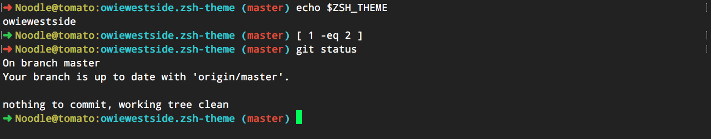

# owiewestside

the theme of kings
[](img/owiewestside.zsh-theme-screenshot.png)


### Install

install to `~/zsh-custom/theme/owiewestside.zsh-theme`

and add

`ZSH_THEME="owiewestside"`  

to your `~/.zshrc`


### What's a computer?

Just run this...

```
$ mkdir -p .zsh-custom/themes
$ curl -o ~/.zsh-custom/themes/owiewestside.zsh-theme https://raw.githubusercontent.com/owenstranathan/owiewestside.zsh-theme/master/owiewestside.zsh-theme
```

then add:

`ZSH_THEME="owiewestside"`  

to your `~/.zshrc`
